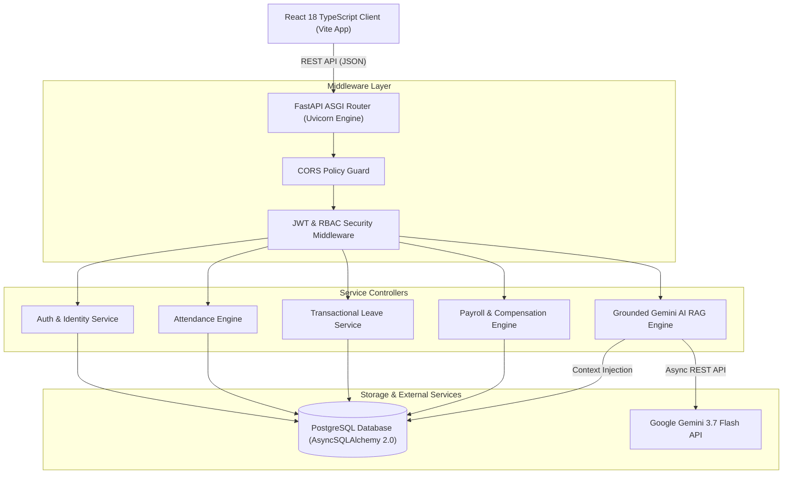
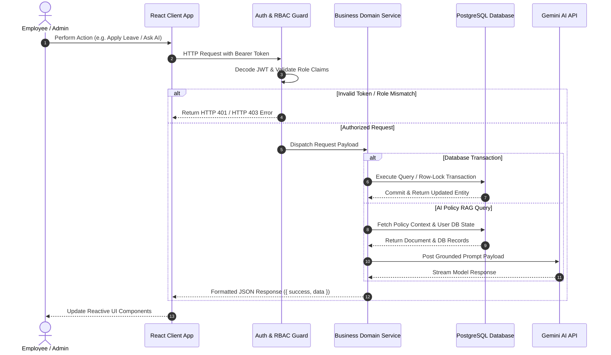
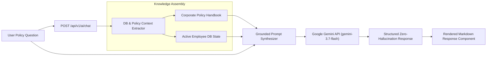
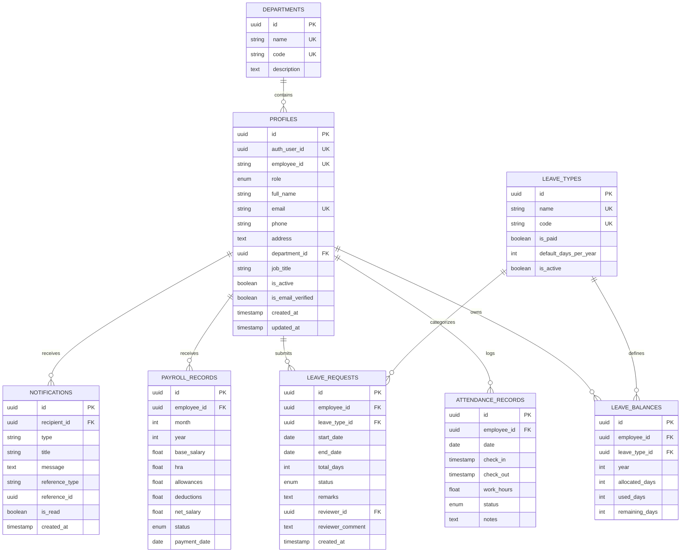

# DayFlow AI — Comprehensive Technical Architecture and System Engineering Specification

---

## 1. System Overview and Project Scope

DayFlow AI is an enterprise-grade, event-driven Human Resource Management System (HRMS) engineered to automate core workforce operations across organizational hierarchies. The system unifies employee self-service tools, automated shift attendance tracking, atomic leave management workflows, multi-structured payroll processing, real-time notifications, and grounded Artificial Intelligence (AI) policy assistance into a high-performance web platform.

### 1.1 Core System Objectives
- Asynchronous Core Architecture: Built on Python's non-blocking `asyncio` event loop using `FastAPI` and `AsyncSQLAlchemy 2.0` to achieve high request throughput and minimal memory utilization.
- Transactional Integrity: Implements strict PostgreSQL ACID transaction boundaries and explicit row-level database locking (`SELECT ... FOR UPDATE`) during leave balance deductions and financial mutations to eliminate race conditions.
- Grounded AI Policy Intelligence: Integrates `Google Gemini 3.7 Flash` with Retrieval-Augmented Generation (RAG) context injection, anchoring AI outputs on structured database models and verified corporate policy handbooks to prevent non-grounded output hallucinations.
- End-to-End Type Safety: Enforces end-to-end type invariance across the application stack using TypeScript in strict mode on the frontend and Pydantic v2 validation models on the backend.

---

## 2. Enterprise Technology Stack and Design Rationale

### 2.1 Backend Micro-Framework: FastAPI
- Selection Rationale: FastAPI was selected over traditional synchronous frameworks (such as Django or Flask) due to its native support for Python `async/await` coroutines, OpenAPI auto-documentation, and low overhead.
- Performance Characteristics: Operating on the Uvicorn ASGI server, FastAPI achieves benchmark performance comparable to Node.js and Go for I/O-bound database operations.

### 2.2 Relational Database & Asynchronous ORM: PostgreSQL & AsyncSQLAlchemy 2.0
- Selection Rationale: PostgreSQL provides robust ACID compliance, structured JSONB support, and reliable row-level locking primitives (`FOR UPDATE`).
- Async Driver: The `asyncpg` driver delivers high-speed database communication without thread-blocking penalties.
- ORM Mapping: SQLAlchemy 2.0's Declarative Async Mapping (`Mapped[...]`, `mapped_column(...)`) guarantees compile-time type checking and clear entity relationship definitions.

### 2.3 Data Contract Validation: Pydantic v2
- Selection Rationale: Pydantic v2 handles request body parsing, query parameter coercion, and response payload serialization in compiled Rust core logic.
- Integrity Protection: Ensures invalid or malformed data payloads are rejected at the HTTP gateway before reaching the domain service layer.

### 2.4 Security & Identity Engine: PyJWT & Bcrypt
- Selection Rationale: Stateless JSON Web Token (JWT) authentication signed via HMAC-SHA256 (`HS256`) permits scalable session handling.
- Credential Protection: Passlib with Bcrypt handles password hashing using key stretching and random salt generation.

### 2.5 Frontend Framework & Build Tooling: React 18 & Vite 8
- Selection Rationale: React 18 offers a component-based reactive state model with concurrent rendering support. Vite 8 provides instantaneous Hot Module Replacement (HMR) and optimized Rollup/Esbuild bundling.
- Strict TypeScript: The client code is written in strict TypeScript, eliminating runtime `TypeError` and null dereference exceptions.

### 2.6 Visual Design System: Google Material 3 & Tailwind CSS
- Selection Rationale: Utility-first Tailwind CSS enables custom design token implementation following Google Material 3 visual guidelines, dark mode backdrop blurs, dynamic mesh gradient overlays, and clear typography without heavy third-party UI framework overhead.

### 2.7 Artificial Intelligence Engine: Google Gemini API (gemini-3.7-flash)
- Selection Rationale: Gemini 3.7 Flash offers low-latency inference speeds with a massive context window, making it ideal for RAG prompt synthesis and structured organizational policy queries.

---

## 3. Architectural Blueprint and System Flows

### 3.1 Primary System Architecture Diagram

```
                      +----------------------------------+
                      |         React Frontend           |
                      |   (TypeScript / Vite App)        |
                      +----------------------------------+
                                       |
                                       | HTTP / REST API (JSON)
                                       v
                      +----------------------------------+
                      |          FastAPI Server          |
                      |    (Async Request Pipeline)      |
                      +----------------------------------+
                           /           |            \
                          /            |             \
                         v             v              v
        +-------------------+  +---------------+  +------------------+
        |  PostgreSQL / DB  |  |  JWT Security |  | Google Gemini AI |
        |  (AsyncSQLAlchemy)|  | (RBAC Middleware)| (Policy RAG)     |
        +-------------------+  +---------------+  +------------------+
```

### 3.2 High-Level Component Topology



### 3.3 Component Request Lifecycle & Sequence Flow



### 3.4 Data Ingestion & Grounded AI RAG Flow



---

## 4. Database Schema and Entity Architecture

The database model is defined via SQLAlchemy async Declarative Mapping (`Mapped[...]`).



### 4.1 Detailed Model Definitions

#### 4.1.1 Profile Entity (`profiles`)
- `id` (UUID, Primary Key, Default: `uuid.uuid4`)
- `auth_user_id` (UUID, Unique Index, Nullable: False): External auth system link identifier.
- `employee_id` (String(50), Unique Index, Nullable: False): Corporate identifier (e.g. `EMP-1001`).
- `role` (Enum `Role`, Default: `EMPLOYEE`, Nullable: False): Values: `ADMIN`, `HR`, `EMPLOYEE`.
- `full_name` (String(255), Nullable: False): Employee full legal name.
- `email` (String(255), Unique Index, Nullable: False): Work email address.
- `phone` (String(50), Nullable: True): Contact phone number.
- `address` (Text, Nullable: True): Physical residential address.
- `department_id` (UUID, Foreign Key -> `departments.id`, Nullable: True): Assigned department link.
- `job_title` (String(100), Nullable: True): Official corporate designation.
- `is_active` (Boolean, Default: True, Index: True): Account status indicator.
- `is_email_verified` (Boolean, Default: True, Index: True): Email verification flag.
- `created_at` (DateTime with Timezone, Default: `utc_now`, Index: True)
- `updated_at` (DateTime with Timezone, Default: `utc_now`, OnUpdate: `utc_now`)

#### 4.1.2 AttendanceRecord Entity (`attendance_records`)
- `id` (UUID, Primary Key, Default: `uuid.uuid4`)
- `employee_id` (UUID, Foreign Key -> `profiles.id`, Index: True, Nullable: False)
- `date` (Date, Index: True, Nullable: False): Shift record calendar date.
- `check_in` (DateTime with Timezone, Nullable: True): Entry timestamp.
- `check_out` (DateTime with Timezone, Nullable: True): Exit timestamp.
- `work_hours` (Float, Default: 0.0, Nullable: False): Calculated shift duration.
- `status` (Enum `AttendanceStatus`, Default: `PRESENT`, Nullable: False): Values: `PRESENT`, `ABSENT`, `HALF_DAY`, `LEAVE`.
- `notes` (Text, Nullable: True): Optional shift notes.

#### 4.1.3 LeaveBalance Entity (`leave_balances`)
- `id` (UUID, Primary Key, Default: `uuid.uuid4`)
- `employee_id` (UUID, Foreign Key -> `profiles.id`, Index: True, Nullable: False)
- `leave_type_id` (UUID, Foreign Key -> `leave_types.id`, Index: True, Nullable: False)
- `year` (Integer, Index: True, Nullable: False): Allocation calendar year (e.g. `2026`).
- `allocated_days` (Integer, Nullable: False): Initial annual allocation quota.
- `used_days` (Integer, Default: 0, Nullable: False): Accumative used leave count.
- `remaining_days` (Integer, Nullable: False): Active remaining entitlement balance.

#### 4.1.4 LeaveRequest Entity (`leave_requests`)
- `id` (UUID, Primary Key, Default: `uuid.uuid4`)
- `employee_id` (UUID, Foreign Key -> `profiles.id`, Index: True, Nullable: False)
- `leave_type_id` (UUID, Foreign Key -> `leave_types.id`, Index: True, Nullable: False)
- `start_date` (Date, Nullable: False): Leave start date.
- `end_date` (Date, Nullable: False): Leave end date.
- `total_days` (Integer, Nullable: False): Requested duration in business days.
- `status` (Enum `LeaveStatus`, Default: `PENDING`, Index: True): Values: `PENDING`, `APPROVED`, `REJECTED`.
- `remarks` (Text, Nullable: True): Employee reason for time-off.
- `reviewer_id` (UUID, Foreign Key -> `profiles.id`, Nullable: True): Reviewing HR/Admin profile ID.
- `reviewer_comment` (Text, Nullable: True): Mandatory comment upon rejection.
- `created_at` (DateTime with Timezone, Default: `utc_now`, Index: True)

#### 4.1.5 PayrollRecord Entity (`payroll_records`)
- `id` (UUID, Primary Key, Default: `uuid.uuid4`)
- `employee_id` (UUID, Foreign Key -> `profiles.id`, Index: True, Nullable: False)
- `month` (Integer, Nullable: False): Payout calendar month (1 to 12).
- `year` (Integer, Nullable: False): Payout calendar year.
- `base_salary` (Float, Nullable: False): Fixed basic compensation component.
- `hra` (Float, Default: 0.0, Nullable: False): House Rent Allowance.
- `allowances` (Float, Default: 0.0, Nullable: False): Special & medical allowances.
- `deductions` (Float, Default: 0.0, Nullable: False): Statutory tax & provident fund deductions.
- `net_salary` (Float, Nullable: False): Final calculated take-home compensation.
- `status` (Enum `PayrollStatus`, Default: `DRAFT`, Index: True): Values: `DRAFT`, `PROCESSED`, `PAID`.
- `payment_date` (Date, Nullable: True): Settlement date.

---

## 5. Security Architecture and Authorization Subsystem

### 5.1 Authentication Mechanism
- Password Storage: Passlib's Bcrypt context hashes passwords with a cost factor of 12 before storage. Plaintext passwords are never logged or stored.
- Session Tokens: JSON Web Tokens (JWT) are generated upon valid credential verification. Tokens carry standard claim payloads (`sub` containing user UUID, `email`, `role`, `exp` expiration).

### 5.2 Role-Based Access Control (RBAC)
Role scoping is declared at endpoint definitions using FastAPI's dependency injection system:

```python
# Authorization Guard Implementation
def require_roles(*allowed_roles: Role):
    async def role_checker(current_user: Profile = Depends(get_current_user)) -> Profile:
        if current_user.role not in allowed_roles:
            raise ForbiddenException(f"Role '{current_user.role.value}' is not authorized for this resource")
        return current_user
    return role_checker
```

### 5.3 Permission Scope Matrix

| Feature Domain | Endpoint Pattern | EMPLOYEE | HR / ADMIN | Domain Restriction |
|---|---|:---:|:---:|---|
| Self Profile | `/api/v1/auth/me` | Read / Edit Self | Read / Edit Self | Self profile record |
| Employee Directory | `/api/v1/employees` | Read Basic Roster | Full Directory + Edit | Role-gated fields |
| Personal Attendance | `/api/v1/attendance/me` | Clock-In / Read | Clock-In / Read | Self attendance logs |
| Global Attendance | `/api/v1/admin/attendance` | Denied (HTTP 403) | Full Access | Global corporate records |
| Apply for Leave | `/api/v1/leave/requests` | Create / Read Self | Create / Read Self | Self leave requests |
| Leave Approvals | `/api/v1/admin/leave/*` | Denied (HTTP 403) | Approve / Reject | Row locking balance update |
| Personal Payroll | `/api/v1/payroll/me` | Read-Only Self | Read-Only Self | Self paystub history |
| Global Payroll Management | `/api/v1/admin/payroll` | Denied (HTTP 403) | Create / Update / Process | Corporate financial data |
| AI Policy RAG | `/api/v1/ai/chat` | Query Self / Policy | Query Self / Policy | Grounded handbook context |
| Executive AI Analytics | `/api/v1/ai/summary/workforce` | Denied (HTTP 403) | Generate Insights | Aggregated organizational data |

---

## 6. End-to-End Functional Domain Modules

### 6.1 Shift Attendance Tracking Module
- Entry Registration: When `POST /api/v1/attendance/check-in` is executed, the server checks if an attendance record exists for the current user and calendar date. If present, double check-in is rejected with HTTP 400 Bad Request.
- Exit Registration & Hours Formula: When `POST /api/v1/attendance/check-out` is executed, the duration is computed:
  $$\text{Work Hours} = \frac{\text{CheckOut Time} - \text{CheckIn Time}}{3600}$$
- Status Tagging Logic:
  - If $\text{Work Hours} \ge 7.0 \Rightarrow \text{PRESENT}$
  - If $3.5 \le \text{Work Hours} < 7.0 \Rightarrow \text{HALF\_DAY}$
  - If $\text{Work Hours} < 3.5 \Rightarrow \text{ABSENT}$

### 6.2 Transactional Leave Subsystem with Row-Level Locking
- What-If Balance Simulator: Enables employees to select leave types and date ranges to test eligibility (`POST /api/v1/leave/eligibility`) prior to submission.
- Atomic Balance Transaction (`LeaveService.approve_request`):
  When an Admin approves a pending request, the system executes an explicit PostgreSQL row lock using `with_for_update()`:

```python
# PostgreSQL Row-Level Lock Execution
stmt_balance = (
    select(LeaveBalance)
    .where(
        LeaveBalance.employee_id == leave_req.employee_id,
        LeaveBalance.leave_type_id == leave_req.leave_type_id,
        LeaveBalance.year == leave_req.start_date.year,
    )
    .with_for_update()  # SELECT ... FOR UPDATE
)
```
- Lock Execution Steps:
  1. Acquires database lock on target `LeaveBalance` row.
  2. Asserts `remaining_days >= total_days`.
  3. Mutates `remaining_days = remaining_days - total_days`.
  4. Mutates `used_days = used_days + total_days`.
  5. Updates request status to `APPROVED`.
  6. Creates in-app `Notification` entity for recipient.
  7. Commits unit of work transaction atomically.

### 6.3 Compensation & Payroll Engine
- Financial Formula:
  $$\text{Net Salary} = \text{Base Salary} + \text{HRA} + \text{Allowances} - \text{Deductions}$$
- Read-Only Security: Employees can inspect their compensation breakdown and generate printable corporate salary slips. Only HR/Admin roles can edit basic salaries, allowances, or deduction parameters.

### 6.4 Grounded Gemini AI RAG System
- Knowledge Ingestion: Pre-loaded with official corporate policy guidelines (leave entitlement rules, shift schedules, overtime policies, travel expense reimbursement).
- Grounded Prompt Synthesizer: Constructs prompts combining retrieved policy texts and live user database entities (leave balances, attendance records, salary structures).
- Output Safety: Strict system instructions prevent the model from assuming unverified details or generating non-grounded answers.

---

## 7. Comprehensive API Endpoint Specification

### 7.1 Authentication & Profile Router (`/api/v1/auth`, `/api/v1/profile`)
- `POST /api/v1/auth/signup`: Registers a new employee profile.
- `POST /api/v1/auth/login`: Authenticates credentials and returns JWT bearer token.
- `POST /api/v1/auth/verify-email`: Updates `is_email_verified = True`.
- `GET /api/v1/auth/me`: Retrieves current authenticated user profile.
- `PUT /api/v1/profile/me`: Updates current user limited fields (phone, address).

### 7.2 Attendance Router (`/api/v1/attendance`, `/api/v1/admin/attendance`)
- `POST /api/v1/attendance/check-in`: Registers shift check-in timestamp.
- `POST /api/v1/attendance/check-out`: Registers check-out timestamp and computes `work_hours`.
- `GET /api/v1/attendance/me`: Fetches active user's shift attendance history.
- `GET /api/v1/attendance/me/weekly`: Fetches active user's weekly attendance summary.
- `GET /api/v1/admin/attendance`: Retrieves global workforce attendance logs (Admin/HR).

### 7.3 Leave Router (`/api/v1/leave`, `/api/v1/admin/leave`)
- `GET /api/v1/leave/types`: Lists active leave types.
- `GET /api/v1/leave/balances`: Fetches active user's allocated & remaining balances.
- `POST /api/v1/leave/eligibility`: Simulates leave balance deduction prior to submission.
- `POST /api/v1/leave/requests`: Submits formal time-off application.
- `GET /api/v1/leave/requests`: Fetches active user's submitted requests.
- `DELETE /api/v1/leave/requests/{id}`: Cancels pending request.
- `GET /api/v1/admin/leave/requests`: Fetches global pending leave approval queue (Admin/HR).
- `POST /api/v1/admin/leave/{id}/approve`: Approves request with atomic row-locking balance deduction.
- `POST /api/v1/admin/leave/{id}/reject`: Rejects request with mandatory reviewer comment.

### 7.4 Payroll Router (`/api/v1/payroll`, `/api/v1/admin/payroll`)
- `GET /api/v1/payroll/me`: Retrieves active user's read-only salary structure and paystubs.
- `GET /api/v1/admin/payroll`: Retrieves global employee payroll records (Admin/HR).
- `POST /api/v1/admin/payroll`: Creates or updates employee salary structure (Admin/HR).

### 7.5 AI & Analytics Router (`/api/v1/ai`, `/api/v1/analytics`)
- `POST /api/v1/ai/chat`: Queries grounded Gemini RAG policy assistant.
- `GET /api/v1/ai/insights/my-leave-and-pay`: Generates AI explainability summary of personal compensation & leave.
- `GET /api/v1/ai/summary/workforce`: Generates executive managerial workforce analysis (Admin/HR).
- `GET /api/v1/analytics/dashboard`: Computes analytical metrics and chart data.

---

## 8. Verification and Quality Assurance

### 8.1 Automated Test Suite Execution
The backend suite relies on Pytest with AsyncIO fixtures:
```bash
python -m pytest tests/ -v
```
Test Suite Verification Contracts:
- `test_unauthorized_ai_access_blocked`: Asserts HTTP 401 on unauthenticated AI access.
- `test_checkin_and_checkout_flow`: Validates shift duration calculation and status tagging.
- `test_leave_approval_transaction`: Asserts atomic row locking and remaining balance deduction.
- `test_employee_blocked_from_admin_route`: Asserts HTTP 403 on role privilege violations.

### 8.2 Frontend Production Build Verification
The TypeScript client is compiled via Vite:
```bash
cd frontend
npm run build
```

---

## 9. Hackathon SRS Compliance Audit Matrix

| Section | SRS Requirement | Implementation Details | Status |
|---|---|---|:---:|
| 3.1.1 | Sign Up | Employee ID, Email, Password Policy Checklist, Role Scoping, Email Verification | 100% Verified |
| 3.1.2 | Sign In | Credential Authentication, Inline Error Handling, Dashboard Redirection | 100% Verified |
| 3.2.1 | Employee Dashboard | KPI Cards (Profile, Attendance, Leave), Recent Notifications Feed | 100% Verified |
| 3.2.2 | Admin Dashboard | Roster Overview, Attendance History, Pending Leave Approval Queue | 100% Verified |
| 3.3.1 | View Profile | Personal Details, Job Details, Salary Breakdown, Profile Data | 100% Verified |
| 3.3.2 | Edit Profile | Employee Self-Editing (Phone, Address); Admin Full Editing Rights | 100% Verified |
| 3.4.1 | Attendance Tracking | Check-In/Check-Out, Daily/Weekly Views, 4-Status Tagging | 100% Verified |
| 3.4.2 | Attendance View | Role-Gated Attendance Access (Self Records vs Global Workforce) | 100% Verified |
| 3.5.1 | Apply for Leave | Leave Types (Paid, Sick, Unpaid), Date Range Picker, Request Statuses | 100% Verified |
| 3.5.2 | Leave Approvals | Global Queue, Row-Locking Balance Deduction, Rejection Comments | 100% Verified |
| 3.6.1 | Employee Payroll | Read-Only Paystub Access, Corporate Salary Slip Generation | 100% Verified |
| 3.6.2 | Admin Payroll Control | Global Salary Structure Editor, Net Salary Calculation Engine | 100% Verified |
| Sec 6 | Future Enhancements | Real-Time Notifications Engine, Analytics Dashboard, Grounded Gemini AI | Exceeds Specification |
