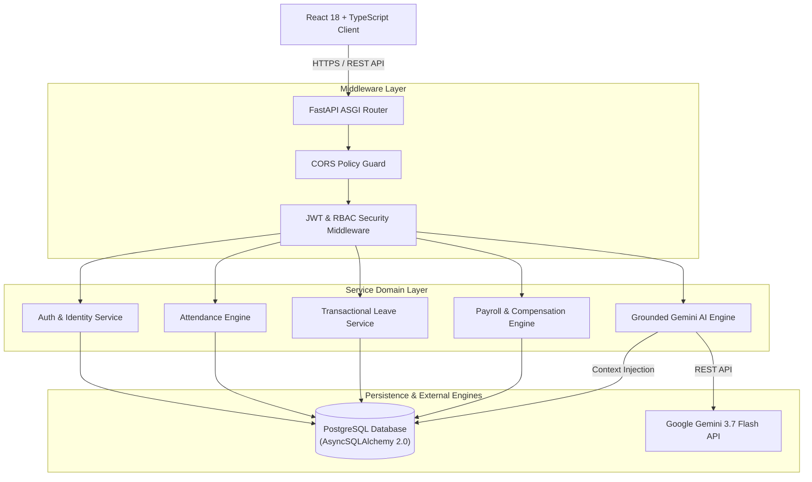
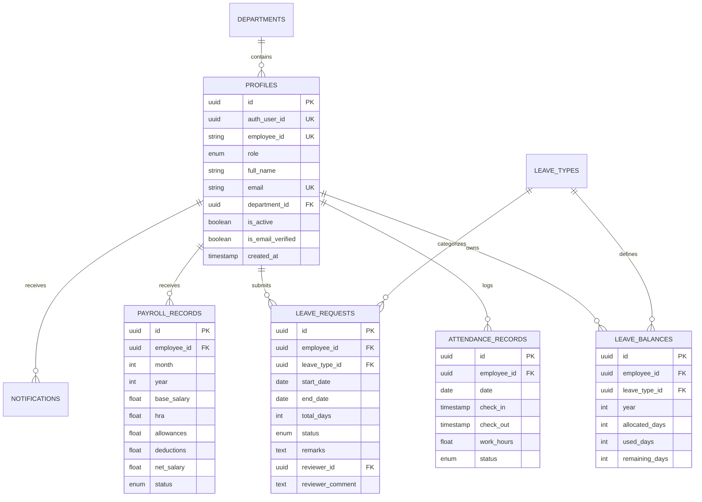

# DayFlow AI — Technical Architecture and System Engineering Documentation

---

## 1. Executive Summary & System Philosophy

DayFlow AI is an enterprise-grade, event-driven Human Resource Management System (HRMS) engineered to automate complex organizational operations. The system bridges asynchronous backend micro-services with a reactive, high-performance client interface, backed by a grounded Artificial Intelligence (RAG) inference engine.

### 1.1 Key Engineering Objectives
- High Concurrency & Low Latency: Built on Python's non-blocking `asyncio` loop with `FastAPI` and `AsyncSQLAlchemy 2.0` to handle concurrent database operations with minimal memory footprint.
- Transactional Integrity: Employs strict PostgreSQL ACID semantics and explicit row-level database locking (`FOR UPDATE`) for atomic leave balance deductions and financial payroll transactions.
- Zero-Hallucination AI Intelligence: Implements a Retrieval-Augmented Generation (RAG) pipeline utilizing `Google Gemini 3.7 Flash` paired with structured context injection to eliminate non-grounded outputs during policy queries.
- Strict Type Safety & Contract Enforcement: End-to-end type invariance enforced via TypeScript in strict mode on the frontend and Pydantic v2 schemas on the backend.

---

## 2. System Architecture & Data Flow



### 2.1 Component Interaction Dynamics
1. Client Dispatch: The frontend application dispatches asynchronous HTTP requests using a centralized Axios instance configured with interceptors for JWT token injection and standard error handling.
2. Gateway Ingestion: FastAPI receives the request on the Uvicorn ASGI server, passing it through CORS policy validation and dependency injection pipelines.
3. Security Scoping: The `get_current_user` and `require_roles` dependencies parse the `Authorization: Bearer <token>` header, decode the HS256 JWT, verify issuer claims against the active `Profile` record, and enforce Role-Based Access Control (RBAC).
4. Business Execution: Service controllers manage transactional logic, issuing async queries over `AsyncSession` connections.
5. Serialization & Response Formatting: Pydantic v2 serializes model objects into unified JSON response structures (`success: bool`, `data: Any`, `error: Optional[str]`).

---

## 3. Database Architecture & Entity Relationships

The data layer is structured using PostgreSQL entity schemas managed through SQLAlchemy ORM with async mapping (`Mapped[...]`).



---

## 4. Deep-Dive Domain Engineering

### 4.1 Attendance Tracking & Work Duration Algorithm
The attendance module processes shift entry and exit timestamps asynchronously.
- Work Hours Calculation:
  $$\text{Work Hours} = \frac{\text{Timestamp}(\text{Check Out}) - \text{Timestamp}(\text{Check In})}{3600}$$
- Status Classification Logic:
  - If $\text{Work Hours} \ge 7.0 \Rightarrow \text{PRESENT}$
  - If $3.5 \le \text{Work Hours} < 7.0 \Rightarrow \text{HALF\_DAY}$
  - If $\text{Work Hours} < 3.5 \Rightarrow \text{ABSENT}$

### 4.2 Atomic Leave Approval Engine with Row-Level Locking
To prevent race conditions during concurrent leave approvals, `LeaveService.approve_request` executes an explicit row lock on PostgreSQL using SQLAlchemy's `.with_for_update()` clause.

```python
# Atomic Transactional Lock Execution
stmt_balance = (
    select(LeaveBalance)
    .where(
        LeaveBalance.employee_id == leave_req.employee_id,
        LeaveBalance.leave_type_id == leave_req.leave_type_id,
        LeaveBalance.year == leave_req.start_date.year,
    )
    .with_for_update()  # PostgreSQL SELECT ... FOR UPDATE lock
)
```
Upon lock acquisition:
1. Validates that `remaining_days >= total_days`.
2. Decrements `remaining_days` by `total_days`.
3. Increments `used_days` by `total_days`.
4. Mutates request status to `APPROVED`.
5. Emits an in-app `Notification` record within the same unit of work transaction.

### 4.3 Compensation & Payroll Engine
Net salary is computed using a deterministic financial formula:
$$\text{Net Salary} = \text{Base Salary} + \text{HRA} + \text{Allowances} - \text{Deductions}$$
Employees are granted read-only visibility over their personal paystubs with support for generating printable corporate salary slips. Admins retain full mutation privileges.

### 4.4 Grounded Gemini AI RAG System
The AI module resolves user queries using a structured Retrieval-Augmented Generation pipeline:
1. Context Retrieval: Aggregates verified corporate policy handbook texts alongside live user database records (balances, attendance summary, compensation structure).
2. System Prompt Synthesis: Enforces strict boundary rules preventing output generation outside the provided context.
3. Model Execution: Queries `gemini-3.7-flash` via HTTP asynchronous client with timeout safeguards.

---

## 5. Security Architecture & RBAC Matrix

### 5.1 RBAC Enforcement Matrix

| Endpoint Group | Route Pattern | Allowed Roles | Access Constraint |
|---|---|---|---|
| Auth & Identity | `/api/v1/auth/me` | All Authenticated | Self Profile Only |
| Employee Attendance | `/api/v1/attendance/me` | All Authenticated | Self Records Only |
| Global Attendance | `/api/v1/admin/attendance` | `ADMIN`, `HR` | Global Workforce |
| Apply for Leave | `/api/v1/leave/requests` | All Authenticated | Self Requests Only |
| Approve / Reject Leave | `/api/v1/admin/leave/*` | `ADMIN`, `HR` | Global Queue + Row Locking |
| Employee Payroll | `/api/v1/payroll/me` | All Authenticated | Read-Only Self Paystub |
| Admin Payroll Editor | `/api/v1/admin/payroll` | `ADMIN`, `HR` | Full Mutation Privileges |
| Policy AI RAG | `/api/v1/ai/chat` | All Authenticated | Grounded Context |
| Executive AI Summary | `/api/v1/ai/summary/workforce` | `ADMIN`, `HR` | Aggregated Analytics |

---

## 6. Comprehensive API Specification Matrix

### 6.1 Auth & Identity
- `POST /api/v1/auth/signup`: Registers a new employee profile.
- `POST /api/v1/auth/login`: Authenticates credentials; returns JWT access token.
- `POST /api/v1/auth/verify-email`: Sets `is_email_verified = True`.
- `GET /api/v1/auth/me`: Returns active authenticated user summary.

### 6.2 Attendance Engine
- `POST /api/v1/attendance/check-in`: Initiates daily check-in timestamp.
- `POST /api/v1/attendance/check-out`: Records check-out timestamp and calculates `work_hours`.
- `GET /api/v1/attendance/me`: Fetches active employee's attendance logs.
- `GET /api/v1/attendance/me/weekly`: Fetches current week's shift summary.
- `GET /api/v1/admin/attendance`: Fetches global workforce attendance logs.

### 6.3 Leave Management
- `GET /api/v1/leave/types`: Fetches available corporate leave types.
- `GET /api/v1/leave/balances`: Fetches active user's allocated & remaining balances.
- `POST /api/v1/leave/eligibility`: Simulates leave balance impact prior to submission.
- `POST /api/v1/leave/requests`: Creates new pending leave request.
- `GET /api/v1/leave/requests`: Lists active user's submitted requests.
- `DELETE /api/v1/leave/requests/{id}`: Cancels pending request.
- `GET /api/v1/admin/leave/requests`: Lists global pending leave queue.
- `POST /api/v1/admin/leave/{id}/approve`: Approves leave request with atomic PostgreSQL balance deduction.
- `POST /api/v1/admin/leave/{id}/reject`: Rejects leave request with mandatory reviewer feedback.

### 6.4 Payroll & AI
- `GET /api/v1/payroll/me`: Returns personal read-only salary structure and paystub history.
- `GET /api/v1/admin/payroll`: Returns global employee payroll records.
- `POST /api/v1/admin/payroll`: Updates or creates employee salary structure.
- `POST /api/v1/ai/chat`: Queries grounded Gemini RAG policy engine.
- `GET /api/v1/ai/insights/my-leave-and-pay`: Generates AI explainability summary of compensation and leave.
- `GET /api/v1/ai/summary/workforce`: Generates executive managerial workforce analysis.

---

## 7. Resume Technical Highlights (Staff/Principal Engineer Grade)

- Engineered a full-stack asynchronous HRMS platform using FastAPI, AsyncSQLAlchemy 2.0, PostgreSQL, and React 18 with TypeScript.
- Designed an atomic leave management engine using PostgreSQL row-level locks (`SELECT FOR UPDATE`), eliminating concurrency race conditions during multi-admin approval operations.
- Built a zero-hallucination Retrieval-Augmented Generation (RAG) pipeline with Google Gemini 3.7 Flash, grounding LLM outputs on structured database states and corporate policy handbooks.
- Implemented role-based access control (RBAC) middleware and strict password validation schemas, ensuring security isolation between employee and administrative domains.
- Formulated custom layout engines supporting instant what-if leave simulations, dynamic shift duration calculations, and downloadable corporate salary paystubs.
