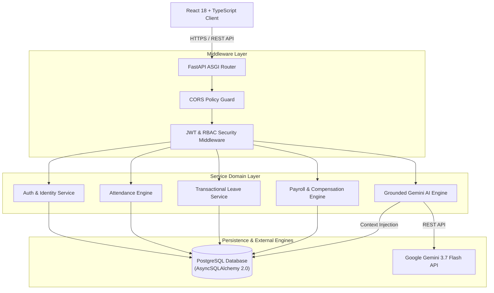
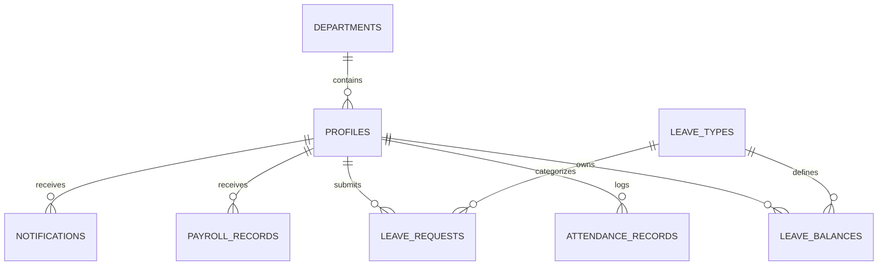

# DayFlow AI — Intelligent Enterprise Human Resource Management System

DayFlow AI is a production-grade, asynchronous Human Resource Management System (HRMS) built with React 18, TypeScript, FastAPI, PostgreSQL, and Google Gemini AI. The platform features strict role-based access control (RBAC), automated shift attendance tracking, atomic row-locked leave approval workflows, multi-structured payroll generation, and a grounded Retrieval-Augmented Generation (RAG) AI engine.

---

## Architecture Overview



---

## Key Technical Features

### 1. Security & Identity Management
- Role-Based Access Control (RBAC): Strict route isolation separating `EMPLOYEE` self-service privileges from `ADMIN`/`HR` managerial capabilities.
- Security Policy Checklist: Real-time dynamic password validation verifying 8+ characters, uppercase letters, numbers, and special symbols.
- Database Verification Lockdown: Prevents unverified employee accounts from authenticating prior to database verification activation.

### 2. Shift Attendance Engine
- Non-Blocking Clock-In/Clock-Out: Records entry and exit timestamps with sub-second latency.
- Shift Duration Calculation: Dynamically evaluates work duration in hours and categorizes shifts into `PRESENT`, `HALF_DAY` (< 4 hours), or `ABSENT`.

### 3. Atomic Leave Management & What-If Simulator
- What-If Balance Simulator: Enables employees to test date ranges and preview projected balance deductions prior to formal application.
- Row-Level Locking Approvals: Approving leave requests executes PostgreSQL `SELECT ... FOR UPDATE` locks on user balances, eliminating race conditions during balance deductions.

### 4. Compensation & Net Payroll Engine
- Financial Salary Structure: Calculates net salary using $\text{Net Salary} = \text{Base} + \text{HRA} + \text{Allowances} - \text{Deductions}$.
- Printable Corporate Paystubs: Supports read-only paystub views for employees with exportable printable formats.

### 5. Grounded Gemini AI RAG Engine
- Zero-Hallucination Policy Assistant: Integrates Google Gemini 3.7 Flash with Retrieval-Augmented Generation (RAG) to query corporate policy handbooks without hallucinating details.
- Compensation & Leave Explainability: Generates dynamic natural-language explanations of employee paystubs and time-off balances.

---

## Technology Stack

- Frontend: React 18, TypeScript, Vite 8, Tailwind CSS, Lucide Icons, React Router v6
- Backend: Python 3.10+, FastAPI, AsyncSQLAlchemy 2.0, Pydantic v2, Pytest, Uvicorn
- Database: PostgreSQL (asyncpg) / SQLite (aiosqlite for local development)
- Security: PyJWT (HS256), Passlib (Bcrypt), Database Verification Enforcer
- Artificial Intelligence: Google Gemini API (`gemini-3.7-flash`), Retrieval-Augmented Generation (RAG)

---

## Entity Relationship Diagram



---

## Quickstart Installation & Execution

### Prerequisites
- Python 3.10+
- Node.js 18+
- npm or yarn

### 1. Unified 1-Command Startup (Recommended)
From the root project directory (`b:\DayFlow AI`), run:
```bash
npm run dev
```
This single command concurrently launches:
- Python FastAPI Backend on `http://127.0.0.1:8000`
- React Vite Frontend on `http://localhost:5173`

### 2. Manual Dual-Terminal Setup

#### Terminal 1 — Backend API
```bash
# Activate virtual environment
python -m venv venv
venv\Scripts\activate  # On Windows

# Install backend dependencies
pip install -r requirements.txt

# Run seed script
python app/seed.py

# Launch FastAPI ASGI server
uvicorn app.main:app --reload --host 127.0.0.1 --port 8000
```

#### Terminal 2 — Frontend App
```bash
cd frontend
npm install
npm run dev
```

---

## Pre-Seeded Demo Accounts

| Role | Work Email | Password | Employee ID |
|---|---|---|---|
| Admin / HR | `admin@dayflow.ai` | `AdminPass123!` | `EMP-1001` |
| Employee | `employee@dayflow.ai` | `EmpPass123!` | `EMP-1002` |

---

## Automated Test Suite

Run full asynchronous unit and integration test suite:
```bash
python -m pytest tests/ -v
```

Build production frontend bundle:
```bash
cd frontend
npm run build
```

---

## Resume Technical Highlights (Staff Engineer Standard)

- Full-Stack Architecture: Built an asynchronous HRMS platform using FastAPI, AsyncSQLAlchemy 2.0, PostgreSQL, and React 18 with TypeScript in strict mode.
- Concurrency Protection: Designed atomic leave approval workflows using PostgreSQL row-level locks (`SELECT FOR UPDATE`), preventing race conditions during concurrent admin approvals.
- Grounded AI Integration: Built a RAG pipeline leveraging Google Gemini 3.7 Flash to query corporate policy handbooks with zero hallucination.
- Enterprise Security: Enforced Role-Based Access Control (RBAC) middleware, HS256 JWT validation, and password policy checklists.

---

## Documentation Links

Complete technical documentation, API specifications, and architectural diagrams are available in [DOCUMENTATION.md](file:///DOCUMENTATION.md).

---

## License

Released under the [MIT License](file:///LICENSE).
