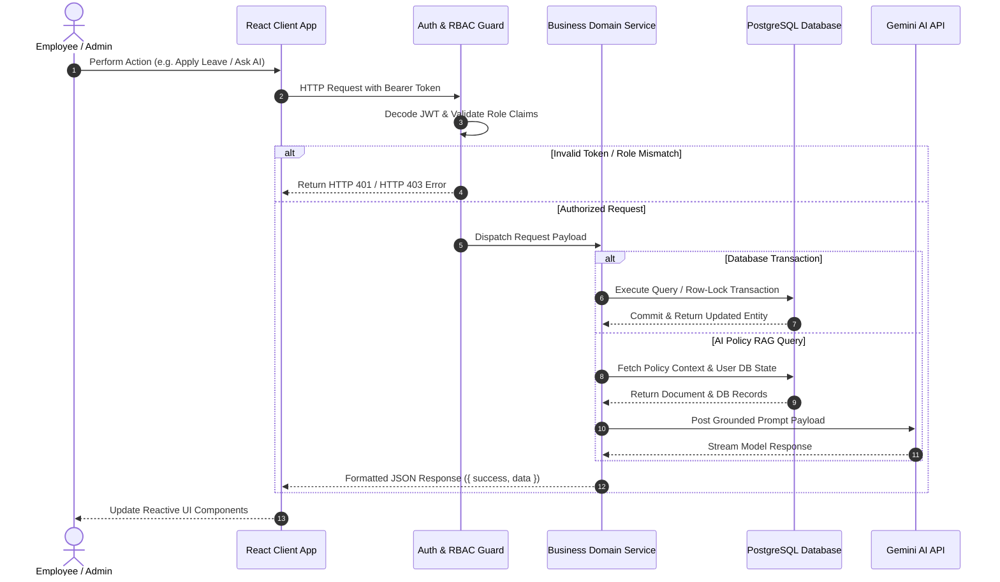
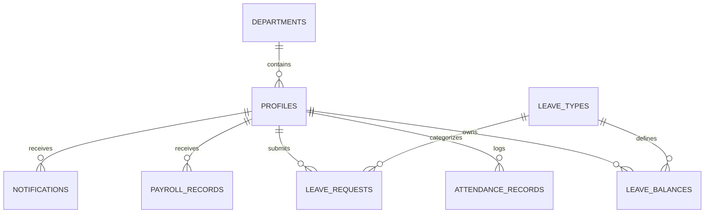

# DayFlow AI — Intelligent Enterprise Human Resource Management System

DayFlow AI is a full-stack, asynchronous Human Resource Management System (HRMS) built using React 18, TypeScript, FastAPI, AsyncSQLAlchemy 2.0, PostgreSQL, and Google Gemini AI. The platform features strict role-based access control (RBAC), automated shift attendance tracking, atomic row-locked leave approval workflows, multi-structured payroll generation, real-time notifications, and a grounded Retrieval-Augmented Generation (RAG) AI engine.

---

## Architectural Topology

```mermaid
graph TD
    Client["React 18 + TypeScript Client\n(Vite Bundle / Axios)"] -->|HTTP / REST API (JSON)| APIGateway["FastAPI ASGI Router\n(Uvicorn Engine)"]
    
    subgraph Middleware Pipeline
        APIGateway --> CORSMiddleware["CORS Policy Guard"]
        CORSMiddleware --> AuthGuard["JWT & RBAC Security Middleware"]
    end

    subgraph Service Controllers
        AuthGuard --> AuthService["Auth & Identity Service"]
        AuthGuard --> AttendanceService["Attendance Engine"]
        AuthGuard --> LeaveService["Transactional Leave Service"]
        AuthGuard --> PayrollService["Payroll & Compensation Engine"]
        AuthGuard --> GeminiAIService["Grounded Gemini AI RAG Engine"]
    end

    subgraph Storage & External Services
        AuthService --> Database[("PostgreSQL Database\n(AsyncSQLAlchemy 2.0)")]
        AttendanceService --> Database
        LeaveService --> Database
        PayrollService --> Database
        GeminiAIService -->|Context Injection| Database
        GeminiAIService -->|Async REST API| GeminiAPI["Google Gemini 3.7 Flash API"]
    end
```

---

## System Sequence Flow



---

## Technology Stack and Technical Rationale

| Infrastructure Layer | Technology / Framework | Technical Rationale |
|---|---|---|
| Backend Framework | FastAPI (Python 3.10+) | Asynchronous ASGI request handling, native coroutine performance, OpenAPI auto-spec |
| ORM Layer | AsyncSQLAlchemy 2.0 | Asynchronous DB mapping, type-safe query building, declarative entity relationships |
| Database Engine | PostgreSQL (asyncpg driver) | ACID transaction guarantees, row-level locking primitives (`FOR UPDATE`), JSONB capability |
| Schema Validation | Pydantic v2 | High-speed data serialization and request contract validation compiled in Rust core |
| Client UI Framework | React 18 & TypeScript | Declarative state management, concurrent rendering, strict static type invariance |
| Frontend Build Tool | Vite 8.x | Rapid Hot Module Replacement (HMR) and optimized minified production bundling |
| Visual Styling | Tailwind CSS & Material 3 | Atomic CSS utilities following Google Material 3 visual standards and responsive layouts |
| Artificial Intelligence | Google Gemini 3.7 Flash API | Low-latency inference, massive context window for RAG handbook context injection |
| Authentication | PyJWT & Passlib (Bcrypt) | Stateless JWT session tokens with HS256 signing and cost-factor 12 password hashing |
| Test Automation | Pytest AsyncIO Suite | Automated unit & integration testing for security, attendance, leave, and payroll contracts |

---

## Key Functional Capabilities

### 1. Identity & Security Architecture
- Role-Based Access Control (RBAC): Strict isolation separating `EMPLOYEE` self-service privileges from `ADMIN`/`HR` managerial capabilities.
- Security Policy Checklist: Real-time dynamic password validation verifying 8+ characters, uppercase letters, numbers, and special symbols.
- Email Verification Enforcer: Ensures user profiles maintain verification flags before system access.

### 2. Shift Attendance Engine
- Non-Blocking Clock-In/Clock-Out: Records shift entry and exit timestamps asynchronously with sub-second latency.
- Shift Duration Calculation: Evaluates work duration in hours:
  $$\text{Work Hours} = \frac{\text{CheckOut Time} - \text{CheckIn Time}}{3600}$$
- Status Tagging: Categorizes shifts into `PRESENT` ($\ge 7.0$h), `HALF_DAY` ($3.5\text{h} \le h < 7.0\text{h}$), or `ABSENT` ($< 3.5$h).

### 3. Atomic Leave Management & What-If Balance Simulator
- What-If Balance Simulator: Enables employees to test date ranges and preview projected balance deductions prior to formal application.
- Row-Level Locking Approvals: Approving leave requests executes PostgreSQL `SELECT ... FOR UPDATE` locks on user balances, eliminating race conditions during balance deductions.

### 4. Compensation & Net Payroll Engine
- Financial Salary Formula: Calculates net compensation:
  $$\text{Net Salary} = \text{Base Salary} + \text{HRA} + \text{Allowances} - \text{Deductions}$$
- Printable Corporate Paystubs: Supports read-only paystub views for employees with exportable printable formats.

### 5. Grounded Gemini AI RAG System
- Zero-Hallucination Policy Assistant: Integrates Google Gemini 3.7 Flash with Retrieval-Augmented Generation (RAG) to query corporate policy handbooks without hallucinating details.
- Compensation & Leave Explainability: Generates dynamic natural-language explanations of employee paystubs and time-off balances.

---

## Entity Relationship Diagram



---

## Installation & Quickstart Execution

### System Prerequisites
- Python 3.10 or higher
- Node.js 18 or higher
- npm or yarn package manager

### 1. Unified 1-Command Startup (Recommended)
From the root project directory (`b:\DayFlow AI`), run:
```bash
npm run dev
```
This single command concurrently launches:
- Python FastAPI Backend on `http://127.0.0.1:8000`
- React Vite Frontend on `http://localhost:5173`

---

### 2. Manual Dual-Terminal Setup

#### Terminal 1 — Backend API
```bash
# Create and activate virtual environment
python -m venv venv
venv\Scripts\activate  # On Windows

# Install backend dependencies
pip install -r requirements.txt

# Seed database with initial data
python app/seed.py

# Launch FastAPI ASGI server
uvicorn app.main:app --reload --host 127.0.0.1 --port 8000
```

#### Terminal 2 — Frontend Application
```bash
cd frontend
npm install
npm run dev
```
Open `http://localhost:5173` in your browser.

---

## Pre-Seeded Demo Accounts

| Role | Work Email | Password | Employee ID |
|---|---|---|---|
| Admin / HR | `admin@dayflow.ai` | `AdminPass123!` | `EMP-1001` |
| Employee | `employee@dayflow.ai` | `EmpPass123!` | `EMP-1002` |

---

## API Endpoint Matrix Summary

| Method | Endpoint | Description | Permission Scope |
|---|---|---|---|
| `POST` | `/api/v1/auth/signup` | Registers new employee profile | Public |
| `POST` | `/api/v1/auth/login` | Authenticates credentials; returns JWT | Public |
| `GET` | `/api/v1/auth/me` | Retrieves active user profile | Authenticated |
| `POST` | `/api/v1/attendance/check-in` | Registers shift check-in timestamp | Authenticated |
| `POST` | `/api/v1/attendance/check-out` | Registers check-out & computes hours | Authenticated |
| `GET` | `/api/v1/attendance/me` | Fetches active user's attendance logs | Authenticated |
| `GET` | `/api/v1/admin/attendance` | Fetches global workforce attendance | `ADMIN`, `HR` |
| `GET` | `/api/v1/leave/balances` | Fetches user leave balance quota | Authenticated |
| `POST` | `/api/v1/leave/eligibility` | Simulates leave balance deduction | Authenticated |
| `POST` | `/api/v1/leave/requests` | Submits formal leave request | Authenticated |
| `GET` | `/api/v1/admin/leave/requests` | Lists global pending leave queue | `ADMIN`, `HR` |
| `POST` | `/api/v1/admin/leave/{id}/approve` | Approves request with atomic DB lock | `ADMIN`, `HR` |
| `POST` | `/api/v1/admin/leave/{id}/reject` | Rejects request with required comment | `ADMIN`, `HR` |
| `GET` | `/api/v1/payroll/me` | Retrieves read-only personal paystub | Authenticated |
| `GET` | `/api/v1/admin/payroll` | Retrieves global employee payrolls | `ADMIN`, `HR` |
| `POST` | `/api/v1/admin/payroll` | Updates employee salary structure | `ADMIN`, `HR` |
| `POST` | `/api/v1/ai/chat` | Queries grounded Gemini RAG assistant | Authenticated |
| `GET` | `/api/v1/ai/summary/workforce` | Generates executive AI workforce summary | `ADMIN`, `HR` |

---

## Testing & Quality Assurance

Run full asynchronous unit and integration test suite:
```bash
python -m pytest tests/ -v
```

Compile production frontend bundle:
```bash
cd frontend
npm run build
```

---

## Documentation Links

Complete technical documentation, database model specifications, and API reference contracts are available in [DOCUMENTATION.md](file:///DOCUMENTATION.md).

---

## License

Released under the [MIT License](file:///LICENSE).
